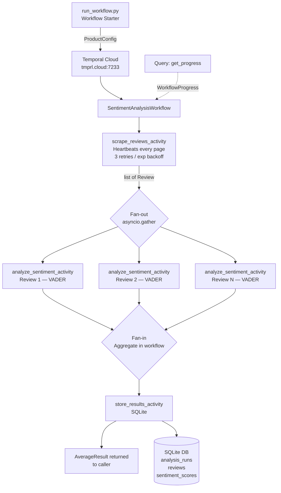

# Temporal Technical Exercise — Product Review Sentiment Pipeline

## Introduction

This project is the SA Technical Interview exercise for Temporal. The chosen use case:

> **A company wants to understand customer sentiment for one of their products. Write a pipeline that scrapes reviews of the product online and runs sentiment analysis on them. Average the sentiment scores to get an overall score for the product.**

The implementation is a Python pipeline built on the Temporal Python SDK, connected to Temporal Cloud. It demonstrates core Temporal patterns: workflow orchestration, activity separation, fan-out/fan-in parallelism, heartbeating, retry policies, and live Query handlers.

See [IMPLEMENTATION-PLAN.md](IMPLEMENTATION-PLAN.md) for the full design rationale.

---

## Architecture



### Key design decisions

| Concern | Choice | Why |
|---|---|---|
| Scraping | Pluggable `ReviewScraper` Protocol; `MockScraper` default | Exercise FAQ recommends mocking; plugin pattern lets real scrapers slot in without touching the workflow or activity |
| Sentiment | VADER | No training, handles informal review text, pure Python, fast |
| Storage | SQLite | Zero-config, stdlib, sufficient for demo |
| Aggregation | Inside the workflow (not an activity) | Pure arithmetic has no side effects — belongs in workflow code, not an activity round-trip |
| Fan-out scope | One activity per review | Each review is independently retryable; Temporal schedules them all in parallel |

---

## Project Structure

```
temporal-technical-exercise/
├── run_workflow.py             # start a workflow or query a running one
├── worker.py                   # poll Temporal Cloud for tasks
├── workflows/
│   └── sentiment_workflow.py   # orchestrates all four stages
├── activities/
│   ├── scrape_reviews.py       # delegates to scraper plugin; heartbeats
│   ├── analyze_sentiment.py    # VADER per-review sentiment scoring
│   └── store_results.py        # SQLite persistence
├── scrapers/
│   ├── base.py                 # ReviewScraper Protocol
│   ├── mock_scraper.py         # deterministic mock Amazon reviews (default)
│   ├── amazon_scraper.py       # Playwright stub — shows real implementation path
│   └── registry.py             # maps scraper_type string → class
├── models/
│   └── data_models.py          # all dataclasses (ProductConfig, Review, …)
├── db/
│   └── init_db.py              # SQLite schema creation
├── tests/
│   ├── conftest.py             # shared fixtures (WorkflowEnvironment, ProductConfig)
│   └── test_workflow.py        # 8 workflow tests
├── pytest.ini
├── CLAUDE.md                   # Claude Code guidelines for this project
├── requirements.txt
└── .env.example
```

---

## Testing

The test suite exercises `SentimentAnalysisWorkflow` end-to-end. Two modes are supported:

**Local (default)** — uses Temporal's in-process test server (`WorkflowEnvironment.start_time_skipping()`), which skips retry backoffs so all 8 tests complete in under a second. No Temporal Cloud connection or running worker needed.

```bash
pytest tests/ -v
```

**Temporal Cloud** — connects to your real Temporal Cloud namespace so workflow executions appear in the Cloud UI. Requires a populated `.env` and no separate worker process (each test spins up its own embedded worker).

```bash
pytest tests/ -v --temporal-cloud
```

All 8 tests run against cloud. The three final-failure tests exhaust all retry attempts with real backoff delays — this is the most interesting thing to observe in the Cloud UI: the full retry history, the backoff progression between attempts, and the final `WorkflowExecutionFailed` status. Expect the full suite to take ~2 minutes in cloud mode (the store final-failure test alone waits ~75 s across 5 retry intervals).

To find test executions in the UI, filter by:
```
WorkflowId STARTS_WITH "test-"
```
or by task queue `test-sentiment-tq` (kept separate from the production task queue).

### What is tested

| Test | Scenario |
|---|---|
| `test_happy_path` | All three activities succeed on the first attempt |
| `test_scrape_occasional_failure` | `scrape_reviews_activity` fails twice, succeeds on the 3rd (retry limit: 3) |
| `test_sentiment_occasional_failure` | `analyze_sentiment_activity` fails once per review, succeeds on the 2nd (retry limit: 2); uses per-review-id counters to stay deterministic across `asyncio.gather` fan-out |
| `test_store_occasional_failure` | `store_results_activity` fails four times, succeeds on the 5th (retry limit: 5) |
| `test_scrape_final_failure` | `scrape_reviews_activity` exhausts all 3 attempts → `WorkflowFailureError` |
| `test_sentiment_final_failure` | `analyze_sentiment_activity` exhausts both attempts for every review → `WorkflowFailureError` |
| `test_store_final_failure` | `store_results_activity` exhausts all 5 attempts → `WorkflowFailureError` |
| `test_query_handler_progress` | `get_progress()` query returns a valid `WorkflowProgress` with a recognized `stage` |

### Design notes

- **Mock activities** are registered under the real activity names (`@activity.defn(name="scrape_reviews_activity")` etc.) so the unmodified workflow code dispatches to them.
- **Failure simulation** uses mutable-dict closures — each call to `make_scrape_activity(fail_times)` creates an independent counter, ensuring no state leaks between tests.
- **Function-scoped environment** — each test gets its own `WorkflowEnvironment` (or Cloud client) and `Worker`, ensuring the time-skipping test server and the Worker always share the same event loop. This guarantees reliable time-skipping at the cost of ~0.1 s per test for server startup.
- **Isolation in Temporal Cloud**: test workflow IDs are prefixed with `test-` and run on the `test-sentiment-tq` task queue, keeping them visually and operationally separate from any production workflows in the same namespace.

---

## Prerequisites

- Python 3.11+
- A [Temporal Cloud](https://cloud.temporal.io) account with a namespace and API key

---

## Setup

```bash
# 1. Install dependencies
pip install -r requirements.txt

# 2. Configure environment
cp .env.example .env
# Edit .env and fill in TEMPORAL_ADDRESS, TEMPORAL_NAMESPACE, TEMPORAL_API_KEY
```

---

## Running

Open two terminal windows.

**Terminal 1 — start the worker**
```bash
python worker.py
```

**Terminal 2 — run a sentiment analysis workflow**
```bash
# Default product: Sony WH-1000XM5 Headphones, 15 reviews, mock scraper
python run_workflow.py

# Custom product
python run_workflow.py --product-name "Kindle Paperwhite" --product-id B09SWRYPB9 --max-reviews 20

# Query live progress of a running workflow (paste the workflow ID from Terminal 2 output)
python run_workflow.py --query-only sentiment-B09XS7JWHH-abc12345
```

**Verify the database was written**
```bash
# Summary of each analysis run
sqlite3 sentiment_results.db "SELECT id, product_name, source, review_count, avg_score, status, run_at FROM analysis_runs;"

# Reviews stored for a specific run (replace 1 with the run id)
sqlite3 sentiment_results.db "SELECT review_id, reviewer, rating, title FROM reviews WHERE run_id = 1;"

# Sentiment scores joined to review text
sqlite3 sentiment_results.db "
SELECT r.reviewer, r.rating, r.title, s.compound, s.positive, s.negative, s.neutral
FROM reviews r
JOIN sentiment_scores s ON s.review_id = r.review_id AND s.run_id = r.run_id
ORDER BY s.compound DESC
LIMIT 20;"

# Row counts across all three tables
sqlite3 sentiment_results.db "
SELECT 'analysis_runs' AS tbl, COUNT(*) AS rows FROM analysis_runs
UNION ALL SELECT 'reviews', COUNT(*) FROM reviews
UNION ALL SELECT 'sentiment_scores', COUNT(*) FROM sentiment_scores;"
```

---

## Temporal Patterns Demonstrated

| Pattern | Where |
|---|---|
| `@workflow.defn` / `@workflow.run` | `workflows/sentiment_workflow.py` |
| `@activity.defn` | `activities/*.py` |
| Heartbeating (`activity.heartbeat`) | `activities/scrape_reviews.py` → `scrapers/mock_scraper.py` |
| Retry policies with exponential backoff | module-level constants in `sentiment_workflow.py` |
| Fan-out / fan-in (`asyncio.gather`) | `sentiment_workflow.py` Stage 2 |
| Query handler (`@workflow.query`) | `SentimentAnalysisWorkflow.get_progress` |
| Temporal Cloud connection (TLS + API key) | `worker.py`, `run_workflow.py` |
| Workflow determinism | no randomness or I/O in workflow code; all side effects in activities |
| Idempotent activity design | mock scraper seeded on `product_id + page` → safe to retry |

---

## Extending to Real Amazon Scraping

The scraper layer is designed to be pluggable:

1. Implement the `ReviewScraper` Protocol in `scrapers/amazon_scraper.py` (stub already provided with selector comments)
2. Install Playwright: `pip install playwright && playwright install chromium`
3. Pass `--scraper amazon` to `run_workflow.py`

No changes to the activity, workflow, or any other layer are required.

---

## Notes on Design Choices

**Why mock scraping?**
The exercise FAQ explicitly recommends mocking external integrations so the focus stays on Temporal patterns. The mock data is structured to mirror real Amazon review fields exactly (rating 1–5, title, body, verified purchase), so the downstream sentiment analysis and storage are exercising the same code paths a real scraper would.

**Why VADER over transformers?**
VADER is lexicon-based — no model download, no GPU, works immediately. For a demo pipeline it gives accurate-enough scores for 1–5 star Amazon-style reviews and keeps the dependency list tiny. The interface is the same regardless of scorer, so swapping in a HuggingFace model later would only touch `analyze_sentiment.py`.

**Why SQLite?**
Zero configuration, no server process, standard library. The schema is normalized enough to support downstream BI tools like Apache Superset (connect via SQLite driver). For production scale, the `store_results_activity` would simply point at Postgres or BigQuery — the Temporal workflow is unchanged.
