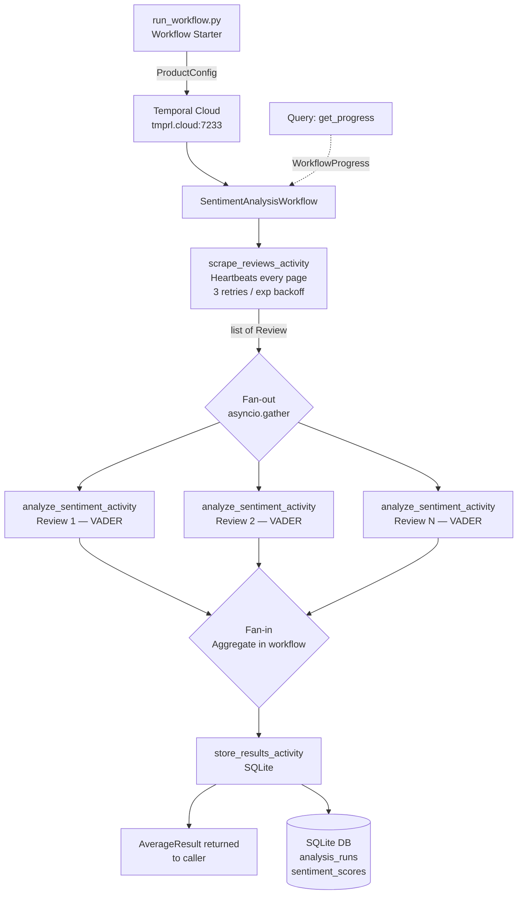

# Temporal Technical Exercise — Product Review Sentiment Pipeline

## Introduction

This project is the SA Technical Interview exercise for Temporal. The chosen use case:

> **A company wants to understand customer sentiment for one of their products. Write a pipeline that scrapes reviews of the product online and runs sentiment analysis on them. Average the sentiment scores to get an overall score for the product.**

The implementation is a Python pipeline built on the Temporal Python SDK, connected to Temporal Cloud. It demonstrates core Temporal patterns: workflow orchestration, activity separation, fan-out/fan-in parallelism, heartbeating, retry policies, and live Query handlers.

See [IMPLEMENTATION-PLAN.md](IMPLEMENTATION-PLAN.md) for the full design rationale.

---

## Architecture



### Key design decisions

| Concern | Choice | Why |
|---|---|---|
| Scraping | Pluggable `ReviewScraper` Protocol; `MockScraper` default | Exercise FAQ recommends mocking; plugin pattern lets real scrapers slot in without touching the workflow or activity |
| Sentiment | VADER | No training, handles informal review text, pure Python, fast |
| Storage | SQLite | Zero-config, stdlib, sufficient for demo |
| Aggregation | Inside the workflow (not an activity) | Pure arithmetic has no side effects — belongs in workflow code, not an activity round-trip |
| Fan-out scope | One activity per review | Each review is independently retryable; Temporal schedules them all in parallel |

---

## Project Structure

```
temporal-technical-exercise/
├── run_workflow.py             # start a workflow or query a running one
├── worker.py                   # poll Temporal Cloud for tasks
├── workflows/
│   └── sentiment_workflow.py   # orchestrates all four stages
├── activities/
│   ├── scrape_reviews.py       # delegates to scraper plugin; heartbeats
│   ├── analyze_sentiment.py    # VADER per-review sentiment scoring
│   └── store_results.py        # SQLite persistence
├── scrapers/
│   ├── base.py                 # ReviewScraper Protocol
│   ├── mock_scraper.py         # deterministic mock Amazon reviews (default)
│   ├── amazon_scraper.py       # Playwright stub — shows real implementation path
│   └── registry.py             # maps scraper_type string → class
├── models/
│   └── data_models.py          # all dataclasses (ProductConfig, Review, …)
├── db/
│   └── init_db.py              # SQLite schema creation
├── CLAUDE.md                   # Claude Code guidelines for this project
├── requirements.txt
└── .env.example
```

---

## Prerequisites

- Python 3.11+
- A [Temporal Cloud](https://cloud.temporal.io) account with a namespace and API key

---

## Setup

```bash
# 1. Install dependencies
pip install -r requirements.txt

# 2. Configure environment
cp .env.example .env
# Edit .env and fill in TEMPORAL_ADDRESS, TEMPORAL_NAMESPACE, TEMPORAL_API_KEY
```

---

## Running

Open two terminal windows.

**Terminal 1 — start the worker**
```bash
python worker.py
```

**Terminal 2 — run a sentiment analysis workflow**
```bash
# Default product: Sony WH-1000XM5 Headphones, 15 reviews, mock scraper
python run_workflow.py

# Custom product
python run_workflow.py --product-name "Kindle Paperwhite" --product-id B09SWRYPB9 --max-reviews 20

# Query live progress of a running workflow (paste the workflow ID from Terminal 2 output)
python run_workflow.py --query-only sentiment-B09XS7JWHH-abc12345
```

**Verify the database was written**
```bash
sqlite3 sentiment_results.db "SELECT id, product_name, review_count, avg_score FROM analysis_runs;"
```

---

## Temporal Patterns Demonstrated

| Pattern | Where |
|---|---|
| `@workflow.defn` / `@workflow.run` | `workflows/sentiment_workflow.py` |
| `@activity.defn` | `activities/*.py` |
| Heartbeating (`activity.heartbeat`) | `activities/scrape_reviews.py` → `scrapers/mock_scraper.py` |
| Retry policies with exponential backoff | module-level constants in `sentiment_workflow.py` |
| Fan-out / fan-in (`asyncio.gather`) | `sentiment_workflow.py` Stage 2 |
| Query handler (`@workflow.query`) | `SentimentAnalysisWorkflow.get_progress` |
| Temporal Cloud connection (TLS + API key) | `worker.py`, `run_workflow.py` |
| Workflow determinism | no randomness or I/O in workflow code; all side effects in activities |
| Idempotent activity design | mock scraper seeded on `product_id + page` → safe to retry |

---

## Extending to Real Amazon Scraping

The scraper layer is designed to be pluggable:

1. Implement the `ReviewScraper` Protocol in `scrapers/amazon_scraper.py` (stub already provided with selector comments)
2. Install Playwright: `pip install playwright && playwright install chromium`
3. Pass `--scraper amazon` to `run_workflow.py`

No changes to the activity, workflow, or any other layer are required.

---

## Notes on Design Choices

**Why mock scraping?**
The exercise FAQ explicitly recommends mocking external integrations so the focus stays on Temporal patterns. The mock data is structured to mirror real Amazon review fields exactly (rating 1–5, title, body, verified purchase), so the downstream sentiment analysis and storage are exercising the same code paths a real scraper would.

**Why VADER over transformers?**
VADER is lexicon-based — no model download, no GPU, works immediately. For a demo pipeline it gives accurate-enough scores for 1–5 star Amazon-style reviews and keeps the dependency list tiny. The interface is the same regardless of scorer, so swapping in a HuggingFace model later would only touch `analyze_sentiment.py`.

**Why SQLite?**
Zero configuration, no server process, standard library. The schema is normalized enough to support downstream BI tools like Apache Superset (connect via SQLite driver). For production scale, the `store_results_activity` would simply point at Postgres or BigQuery — the Temporal workflow is unchanged.
