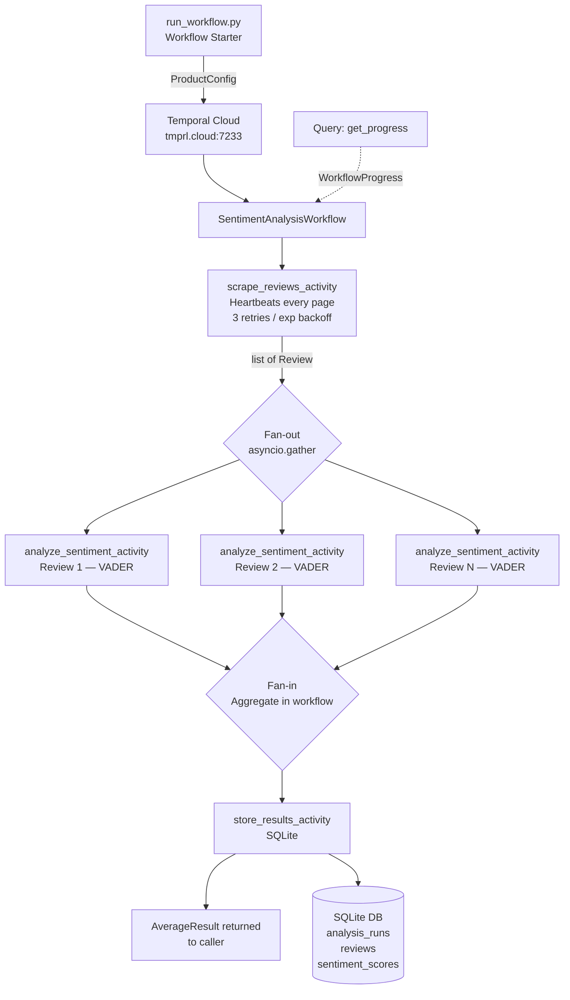

# Temporal Technical Exercise — Product Review Sentiment Pipeline

## Table of Contents

- [Introduction](#introduction)
- [Architecture](#architecture)
- [Project Structure](#project-structure)
- [Temporal Patterns Demonstrated](#temporal-patterns-demonstrated)
- [Prerequisites](#prerequisites)
- [Setup](#setup)
- [Running](#running)
- [Testing](#testing)
- [Logging](#logging)
- [Extending to Real Amazon Scraping](#extending-to-real-amazon-scraping)
- [Notes on Design Choices](#notes-on-design-choices)
- [Reliability Improvements](#reliability-improvements)

---

## Introduction

This project is the SA Technical Interview exercise for Temporal. The chosen use case:

> **A company wants to understand customer sentiment for one of their products. Write a pipeline that scrapes reviews of the product online and runs sentiment analysis on them. Average the sentiment scores to get an overall score for the product.**

The implementation is a Python pipeline built on the Temporal Python SDK, connected to Temporal Cloud. It demonstrates core Temporal patterns: workflow orchestration, activity separation, fan-out/fan-in parallelism, heartbeating, retry policies, and live Query handlers.

See [INITIAL-SPEC.md](INITIAL-SPEC.md) for the spec Sherman gave to Claude Code that generated the code, tests and documentation.

See [IMPLEMENTATION-PLAN.md](IMPLEMENTATION-PLAN.md) for the full design rationale.

---

## Architecture



### Key design decisions

| Concern | Choice | Why |
|---|---|---|
| Scraping | Pluggable `ReviewScraper` Protocol; `MockScraper` default | Exercise FAQ recommends mocking; plugin pattern lets real scrapers slot in without touching the workflow or activity |
| Sentiment | VADER | No training, handles informal review text, pure Python, fast |
| Storage | SQLite | Zero-config, stdlib, sufficient for demo |
| Aggregation | Inside the workflow (not an activity) | Pure arithmetic has no side effects — belongs in workflow code, not an activity round-trip |
| Fan-out scope | One activity per review | Each review is independently retryable; Temporal schedules them all in parallel |

---

## Project Structure

```
temporal-technical-exercise/
├── run_workflow.py             # start a workflow or query a running one
├── worker.py                   # poll Temporal Cloud for tasks
├── workflows/
│   └── sentiment_workflow.py   # orchestrates all four stages
├── activities/
│   ├── scrape_reviews.py       # delegates to scraper plugin; heartbeats
│   ├── analyze_sentiment.py    # VADER per-review sentiment scoring
│   └── store_results.py        # SQLite persistence
├── scrapers/
│   ├── base.py                 # ReviewScraper Protocol
│   ├── mock_scraper.py         # deterministic mock Amazon reviews (default)
│   ├── amazon_scraper.py       # Playwright stub — shows real implementation path
│   └── registry.py             # maps scraper_type string → class
├── models/
│   └── data_models.py          # all dataclasses (ProductConfig, Review, …)
├── db/
│   └── init_db.py              # SQLite schema creation
├── tests/
│   ├── conftest.py             # shared fixtures (WorkflowEnvironment, ProductConfig)
│   └── test_workflow.py        # 11 workflow tests
├── pytest.ini
├── CLAUDE.md                   # Claude Code guidelines for this project
├── requirements.txt
└── .env.example
```

---

## Temporal Patterns Demonstrated

| Pattern | Where |
|---|---|
| `@workflow.defn` / `@workflow.run` | `workflows/sentiment_workflow.py` |
| `@activity.defn` | `activities/*.py` |
| Heartbeating (`activity.heartbeat`) with `heartbeat_timeout` | all three activities; `heartbeat_timeout` set on every `execute_activity` call |
| Retry policies with exponential backoff | module-level constants in `sentiment_workflow.py`; each policy has explicit `backoff_coefficient` |
| Fan-out / fan-in (`asyncio.gather`) | `sentiment_workflow.py` Stage 2 |
| Query handler (`@workflow.query`) | `SentimentAnalysisWorkflow.get_progress` |
| Temporal Cloud connection (TLS + API key) | `worker.py`, `run_workflow.py` |
| Workflow determinism | no randomness or I/O in workflow code; all side effects in activities |
| Idempotent activity design | scraper seeded on `product_id + page`; store activity uses `workflow_run_id` as idempotency key |
| `ApplicationError(non_retryable=True)` | `activities/scrape_reviews.py` — unknown scraper type fails immediately without retrying |
| Worker concurrency limits | `max_concurrent_activity_task_executions` and `max_concurrent_workflow_task_executions` set in `worker.py` |

---

## Prerequisites

- Python 3.11+
- A [Temporal Cloud](https://cloud.temporal.io) account with a namespace and API key

---

## Setup

```bash
# 1. Install dependencies
pip install -r requirements.txt

# 2. Configure environment
cp .env.example .env
# Edit .env and fill in TEMPORAL_ADDRESS, TEMPORAL_NAMESPACE, TEMPORAL_API_KEY
```

---

## Running

Open two terminal windows.

**Terminal 1 — start the worker**
```bash
python worker.py
```

`worker.py` has no CLI flags. All configuration is via environment variables (set in `.env`):

| Variable | Required | Description |
|---|---|---|
| `TEMPORAL_ADDRESS` | yes | Temporal Cloud gRPC endpoint, e.g. `<namespace>.tmprl.cloud:7233` |
| `TEMPORAL_NAMESPACE` | yes | Temporal Cloud namespace |
| `TEMPORAL_API_KEY` | yes | Temporal Cloud API key |
| `TASK_QUEUE` | yes | Task queue name the worker polls |
| `LOG_CONFIG` | no | Path to a JSON `dictConfig` logging file; defaults to `logging.json` if present (see [Logging](#logging)) |

**Terminal 2 — run a sentiment analysis workflow**
```bash
# Default product: Sony WH-1000XM5 Headphones, 15 reviews, mock scraper
python run_workflow.py

# Custom product
python run_workflow.py --product-name "Kindle Paperwhite" --product-id B09SWRYPB9 --max-reviews 20

# Query live progress of a running workflow (paste the workflow ID from Terminal 2 output)
python run_workflow.py --query-only sentiment-B09XS7JWHH-abc12345
```

`run_workflow.py` CLI options:

| Flag | Default | Description |
|---|---|---|
| `--product-name TEXT` | `Sony WH-1000XM5 Headphones` | Display name of the product to analyse |
| `--product-id TEXT` | `B09XS7JWHH` | Unique product identifier (used as part of the workflow ID) |
| `--source-url TEXT` | `https://www.amazon.com/dp/B09XS7JWHH` | Source URL passed to the scraper |
| `--max-reviews INT` | `15` | Maximum number of reviews to scrape |
| `--scraper {mock,amazon}` | `mock` | Scraper plugin to use |
| `--query-only WORKFLOW_ID` | — | Print live progress for an already-running workflow and exit |
| `--log-config PATH` | `logging.json` if present | Path to a JSON `dictConfig` logging file (see [Logging](#logging)) |

**Verify the database was written**
```bash
# Summary of each analysis run
sqlite3 sentiment_results.db "SELECT id, product_name, source, review_count, avg_score, status, run_at FROM analysis_runs;"

# Reviews stored for a specific run (replace 1 with the run id)
sqlite3 sentiment_results.db "SELECT review_id, reviewer, rating, title FROM reviews WHERE run_id = 1;"

# Sentiment scores joined to review text
sqlite3 sentiment_results.db "
SELECT r.reviewer, r.rating, r.title, s.compound, s.positive, s.negative, s.neutral
FROM reviews r
JOIN sentiment_scores s ON s.review_id = r.review_id AND s.run_id = r.run_id
ORDER BY s.compound DESC
LIMIT 20;"

# Row counts across all three tables
sqlite3 sentiment_results.db "
SELECT 'analysis_runs' AS tbl, COUNT(*) AS rows FROM analysis_runs
UNION ALL SELECT 'reviews', COUNT(*) FROM reviews
UNION ALL SELECT 'sentiment_scores', COUNT(*) FROM sentiment_scores;"
```

---

## Testing

The test suite exercises `SentimentAnalysisWorkflow` end-to-end with 11 tests. Two modes are supported:

**Local (default)** — uses Temporal's in-process test server (`WorkflowEnvironment.start_time_skipping()`), which skips retry backoffs so all 8 tests complete in under a second. No Temporal Cloud connection or running worker needed.

```bash
pytest tests/ -v
# DEBUG-level log written to logs/pytest.log by default
```

**Temporal Cloud** — connects to your real Temporal Cloud namespace so workflow executions appear in the Cloud UI. Requires a populated `.env` and no separate worker process (each test spins up its own embedded worker).

```bash
pytest tests/ -v --temporal-cloud
```

All 11 tests run against cloud. The three final-failure tests exhaust all retry attempts with real backoff delays — this is the most interesting thing to observe in the Cloud UI: the full retry history, the backoff progression between attempts, and the final `WorkflowExecutionFailed` status. Expect the full suite to take ~3 minutes in cloud mode (the store final-failure test alone waits ~75 s across 5 retry intervals).

To find test executions in the UI, filter by:
```
WorkflowId STARTS_WITH "test-"
```
or by task queue `test-sentiment-tq` (kept separate from the production task queue).

### What is tested

| Test | Scenario |
|---|---|
| `test_happy_path` | All three activities succeed on the first attempt |
| `test_scrape_occasional_failure` | `scrape_reviews_activity` fails twice, succeeds on the 3rd (retry limit: 3) |
| `test_sentiment_occasional_failure` | `analyze_sentiment_activity` fails once per review, succeeds on the 2nd (retry limit: 2); uses per-review-id counters to stay deterministic across `asyncio.gather` fan-out |
| `test_store_occasional_failure` | `store_results_activity` fails four times, succeeds on the 5th (retry limit: 5) |
| `test_scrape_final_failure` | `scrape_reviews_activity` exhausts all 3 attempts → `WorkflowFailureError` |
| `test_sentiment_final_failure` | `analyze_sentiment_activity` exhausts both attempts for every review → `WorkflowFailureError` |
| `test_store_final_failure` | `store_results_activity` exhausts all 5 attempts → `WorkflowFailureError` |
| `test_query_handler_progress` | `get_progress()` query returns a valid `WorkflowProgress` with a recognized `stage` |
| `test_dataclass_validation` | `ProductConfig` and `Review` `__post_init__` guards reject invalid field values (`max_reviews < 1`, empty `product_id`, `rating` outside 1–5) |
| `test_invalid_scraper_type` | Unknown `scraper_type` raises `ApplicationError(non_retryable=True)` — verified by inspecting the `WorkflowFailureError → ActivityError → ApplicationError` chain |
| `test_store_activity_idempotency` | Calling `store_results_activity` twice with the same `workflow_run_id` produces exactly one row in `analysis_runs`; the second call returns the existing `run_id` |

### Design notes

- **Mock activities** are registered under the real activity names (`@activity.defn(name="scrape_reviews_activity")` etc.) so the unmodified workflow code dispatches to them.
- **Failure simulation** uses mutable-dict closures — each call to `make_scrape_activity(fail_times)` creates an independent counter, ensuring no state leaks between tests.
- **Function-scoped environment** — each test gets its own `WorkflowEnvironment` (or Cloud client) and `Worker`, ensuring the time-skipping test server and the Worker always share the same event loop. This guarantees reliable time-skipping at the cost of ~0.1 s per test for server startup.
- **Isolation in Temporal Cloud**: test workflow IDs are prefixed with `test-` and run on the `test-sentiment-tq` task queue, keeping them visually and operationally separate from any production workflows in the same namespace.

---

## Logging

### Default behavior

Both entry points automatically load [`logging.json`](logging.json) when it is present in the working directory. The default config writes `INFO`-level logs to stdout **and** to a rotating file at `logs/temporal_pipeline.log` (10 MB per file, 5 backups):

```
2026-04-20T14:32:01 INFO     worker — Worker started — namespace=prod.acme queue=sentiment-tq
2026-04-20T14:32:03 INFO     activities.scrape_reviews — Scrape complete — product_id=B09XS7JWHH reviews=15
2026-04-20T14:32:04 INFO     activities.store_results — Stored results — product=Sony WH-1000XM5 run_id=7 …
```

Tests write a full `DEBUG`-level log to `logs/pytest.log` via `pytest.ini`.

### Overriding the config

Supply a different JSON file that follows Python's [`logging.config.dictConfig`](https://docs.python.org/3/library/logging.config.html#logging-config-dictschema) schema:

```bash
# worker.py — override via env var
LOG_CONFIG=my_logging.json python worker.py

# run_workflow.py — override via CLI flag
python run_workflow.py --log-config my_logging.json
```

To disable file logging entirely and use stdout only, pass an empty string:

```bash
LOG_CONFIG="" python worker.py
python run_workflow.py --log-config ""
```

Individual pytest settings can be overridden inline without editing `pytest.ini`:

```bash
# Enable live terminal output
pytest tests/ -v -o "log_cli=true" -o "log_cli_level=DEBUG"

# Write to a different log file
pytest tests/ -v -o "log_file=logs/my_run.log"
```

### Log levels

| Logger | Default level | What it emits |
|---|---|---|
| `worker` | INFO | startup line with namespace and task queue |
| `activities.scrape_reviews` | INFO | scrape start / completion with review count; DEBUG per heartbeat page |
| `activities.analyze_sentiment` | DEBUG | per-review compound score (silent at default INFO level) |
| `activities.store_results` | INFO | DB commit with `run_id`, `review_count`, `avg_compound` |
| `workflows.sentiment_workflow` | INFO | stage transitions via `workflow.logger` (Temporal's determinism-safe logger) |

`activities.*` loggers are set to `DEBUG` in the default `logging.json`, so per-review scores appear in `logs/temporal_pipeline.log` but not on stdout.

---

## Extending to Real Amazon Scraping

The scraper layer is designed to be pluggable:

1. Implement the `ReviewScraper` Protocol in `scrapers/amazon_scraper.py` (stub already provided with selector comments)
2. Install Playwright: `pip install playwright && playwright install chromium`
3. Pass `--scraper amazon` to `run_workflow.py`

No changes to the activity, workflow, or any other layer are required.

---

## Notes on Design Choices

**Why mock scraping?**
The exercise FAQ explicitly recommends mocking external integrations so the focus stays on Temporal patterns. The mock data is structured to mirror real Amazon review fields exactly (rating 1–5, title, body, verified purchase), so the downstream sentiment analysis and storage are exercising the same code paths a real scraper would.

**Why VADER over transformers?**
VADER is lexicon-based — no model download, no GPU, works immediately. For a demo pipeline it gives accurate-enough scores for 1–5 star Amazon-style reviews and keeps the dependency list tiny. The interface is the same regardless of scorer, so swapping in a HuggingFace model later would only touch `analyze_sentiment.py`.

**Why SQLite?**
Zero configuration, no server process, standard library. The schema is normalized enough to support downstream BI tools like Apache Superset (connect via SQLite driver). For production scale, the `store_results_activity` would simply point at Postgres or BigQuery — the Temporal workflow is unchanged.

---

## Reliability Improvements

The following changes were made after a Temporal SDK best-practice review. Each addresses a specific gap in how Temporal detects failures, retries work, and enforces operational constraints.

### Heartbeating on all activities

**Before:** Only `scrape_reviews_activity` called `activity.heartbeat()` and only it had `heartbeat_timeout` set in the workflow's `execute_activity` call. `analyze_sentiment_activity` and `store_results_activity` had no heartbeat at all.

**Problem:** `heartbeat_timeout` is only meaningful if the activity actually calls `activity.heartbeat()`. Without it, Temporal cannot distinguish a healthy long-running activity from a worker that has silently crashed. Temporal will wait the full `start_to_close_timeout` (30 s for sentiment, 60 s for store) before declaring the activity failed and retrying it — a significant delay in crash detection, especially for the fan-out sentiment tasks where every one of N parallel activities could hang simultaneously.

**Fix:**
- `analyze_sentiment_activity` calls `activity.heartbeat({"review_id": ...})` once before returning — sufficient for a fast activity, but it resets the heartbeat timer so Temporal knows the worker is alive.
- `store_results_activity` calls `activity.heartbeat({"reviews_inserted": i + 1})` every 50 rows in the insert loop — important for large review counts where the bulk insert takes measurable time.
- Both activities now have `heartbeat_timeout` set in their `execute_activity` calls (`10 s` and `15 s` respectively). If a worker crashes mid-execution, Temporal retries on another worker within that window rather than waiting for the full timeout.

### Exponential backoff on `_SENTIMENT_RETRY`

**Before:** `_SENTIMENT_RETRY` had no `backoff_coefficient`, which defaults to `1.0` — a fixed 2 s retry interval regardless of attempt number.

**Problem:** Fixed-interval retries cause retry storms. If many sentiment activities fail simultaneously (e.g., a transient memory pressure spike), they all retry at the same instant, recreating the same pressure. Exponential backoff spreads the load.

**Fix:** Added `backoff_coefficient=1.5`, making the retry intervals 2 s → 3 s → 4.5 s. This is consistent with `_SCRAPE_RETRY` (coefficient 2.0) and `_STORE_RETRY` (coefficient 2.0), which already had it set.

### Worker concurrency limits

**Before:** The `Worker` constructor had no `max_concurrent_activity_task_executions` or `max_concurrent_workflow_task_executions`.

**Problem:** A workflow with hundreds of reviews fires hundreds of sentiment activity tasks simultaneously. Without a cap, the worker accepts all of them, loading as many VADER analyses as the Temporal server schedules. This can exhaust memory and CPU on a single worker process.

**Fix:** Set `max_concurrent_activity_task_executions=50` and `max_concurrent_workflow_task_executions=10` in `worker.py`. The worker will pull at most 50 activity tasks at once from the task queue; excess tasks remain queued in Temporal until capacity is available.

### Store activity idempotency via `workflow_run_id`

**Before:** `store_results_activity` did a plain `INSERT INTO analysis_runs ...` with no deduplication.

**Problem:** If the activity completes its SQLite commit but the worker crashes before it can report completion to Temporal, Temporal will schedule a retry. The retry inserts a second `analysis_runs` row for the same workflow execution — a silent duplicate that inflates row counts and skews any aggregation over historical runs.

**Fix:**
- Added a `workflow_run_id TEXT` column to `analysis_runs`. On each invocation, `activity.info().workflow_run_id` is used as an idempotency key: the activity first checks whether a row with that `workflow_run_id` already exists, and if so returns the existing `run_id` without re-inserting.
- A partial unique index (`WHERE workflow_run_id IS NOT NULL`) enforces the constraint at the database level so concurrent retries can't race past the check.
- A migration step in `init_db()` handles existing databases that don't yet have the column.

### `ApplicationError(non_retryable=True)` for configuration errors

**Before:** If `ProductConfig.scraper_type` named an unregistered scraper, `get_scraper()` raised a plain `ValueError`. Temporal treated this as a retryable failure and attempted all 3 scrape retries before giving up.

**Problem:** An unknown scraper type is a configuration error, not a transient fault. Retrying it wastes time and pollutes the workflow event history with redundant `ActivityTaskFailed` events.

**Fix:** `scrape_reviews_activity` catches `ValueError` from the registry lookup and re-raises as `ApplicationError(non_retryable=True)`. Temporal marks the activity failed immediately on the first attempt and propagates the error to the workflow without consuming any retry budget.

### Input validation on dataclasses

**Before:** `ProductConfig` and `Review` were plain dataclasses with no field validation.

**Problem:** An invalid value (e.g., `max_reviews=0`, `rating=7`) would serialize into the workflow history and potentially cause confusing arithmetic errors deep in the pipeline rather than a clear failure at the input boundary.

**Fix:** Added `__post_init__` methods to `ProductConfig` (validates `max_reviews >= 1` and non-empty `product_id`) and `Review` (validates `1 <= rating <= 5`). These raise `ValueError` before the workflow is even started, giving callers an immediate and descriptive error.

### Database indexes and foreign key enforcement

**Before:** The SQLite schema had no indexes beyond implicit primary keys, and `PRAGMA foreign_keys` was never enabled (SQLite disables FK enforcement by default).

**Fix:** Added `CREATE INDEX` statements on `reviews.run_id` and `sentiment_scores.run_id` — the join columns for any result-fetching query. Added `PRAGMA foreign_keys = ON` to both `init_db()` and each connection opened in `store_results_activity` so referential integrity is actually enforced at runtime.
